# 🛡️ PSMM — Supervision de sécurité

> **P**ython · **S**hell · **M**aria**D**B · **M**ail
> Centralisation des protocoles de gestion d'erreurs — infrastructure Debian

Projet réalisé dans le cadre du **Bachelor IT Cybersécurité** — La Plateforme.

---

## 📖 Objectif

Mettre en place un **système de supervision de sécurité** qui :

1. **Collecte** les tentatives d'accès frauduleuses sur les serveurs FTP, SQL et Web (via SSH)
2. **Archive** ces tentatives dans une base de données MariaDB centrale
3. **Alerte** l'administrateur par **mail** et **Google Chat**

Le tout automatisé, planifié et sécurisé.

---

## 🏗️ Architecture

```
                    ┌─────────────────────────┐
                    │      pokemon_client      │
                    │  Poste de supervision    │
                    │  Python · pilote en SSH  │
                    └───────────┬─────────────┘
                                │ SSH (par clé)
          ┌─────────────────────┼─────────────────────┐
          │                     │                     │
   ┌──────▼──────┐       ┌──────▼──────┐       ┌──────▼───────┐
   │ pokemon_ftp │       │ pokemon_web │       │pokemon_mariadb│
   │   vsftpd    │       │Apache+auth  │       │MariaDB · base │
   │             │       │   basic     │       │    psmm       │
   └─────────────┘       └─────────────┘       └───────────────┘
```

- **4 VM Debian 13** sous VMware
- Réseau de la plateforme (bridge Ethernet, portail **Alcasar**)
- Communication **SSH par clé uniquement** entre le client et les serveurs

---

## 🔒 Sécurité

| Mesure | Détail |
|--------|--------|
| **SSH durci** | Mot de passe désactivé · root interdit · seul le compte `monitor` autorisé (`AllowUsers`) |
| **sudo granulaire** | Via `/etc/sudoers.d/` — `NOPASSWD` limité aux seules commandes nécessaires (moindre privilège) |
| **Secrets isolés** | Mots de passe et webhooks dans `.env`, exclu de Git (`.gitignore`) |
| **Identités uniques** | Clés d'hôte SSH et `machine-id` régénérés sur chaque clone |

---

## 📂 Structure du dépôt

```
PSMM/
├── config.py            # Configuration centrale (IP, chemins ; secrets via .env)
├── mailer.py            # Module d'envoi de mail (Gmail/Workspace SMTP)
├── chat_notifier.py     # Module d'envoi Google Chat (webhook)
├── requirements.txt     # Dépendances Python
├── .env.example         # Modèle de configuration des secrets
├── scripts/             # Les livrables (scripts de supervision ssh_*.py)
├── tools/               # Utilitaires de test (génération de fausses tentatives)
└── docs/                # Support de soutenance + captures
```

---

## ⚙️ Installation

```bash
python3 -m venv psmm-venv
source psmm-venv/bin/activate
pip install -r requirements.txt
cp .env.example .env      # puis renseigner les secrets
```

---

## 🧩 Les scripts (Jobs)

### Job 01 — 3 serveurs Debian durcis
Création des 3 serveurs (FTP, Web, MariaDB), SSH par clé, root interdit, `monitor` dans le groupe sudo.

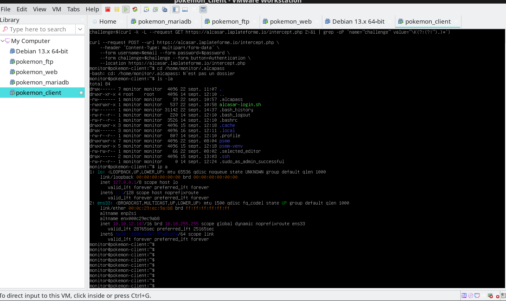
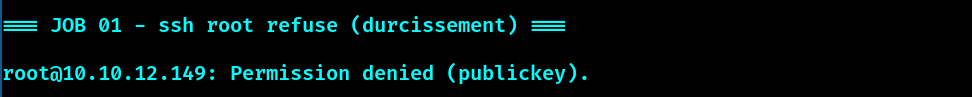

### Job 02 — VM cliente (boîte à outils)
Debian sans GUI · Python + venv · mariadb-client · client FTP · paramiko.

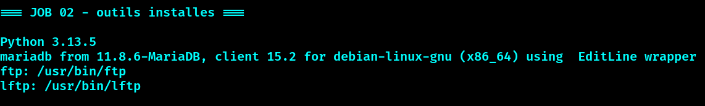

### Job 03 — `ssh_login.py`
Connexion SSH à un serveur et exécution d'une commande shell distante.

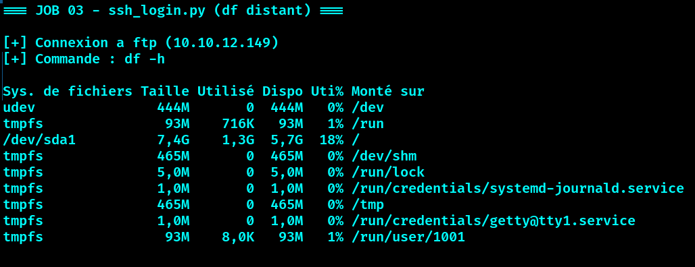

### Job 04 — `ssh_login_sudo.py`
Commande distante en `sudo`, via `sudoers.d` avec NOPASSWD ciblé.

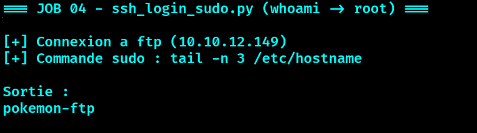

### Job 05 — `ssh_mysql.py`
Vérification de l'accès au serveur MariaDB.

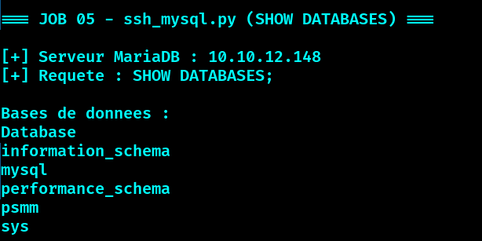

### Job 06 — `ssh_mysql_error.py` (collecte SQL)
Récupération des tentatives d'accès MariaDB échouées → base `psmm.sql_errors`.

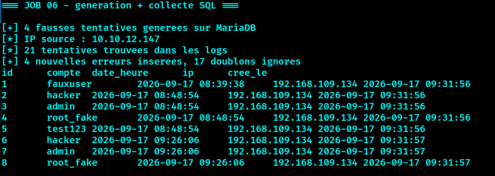

### Job 07 — `ssh_ftp_error.py` (collecte FTP)
Logs vsftpd (PAM) → extraction date/compte/IP → `psmm.ftp_errors`.

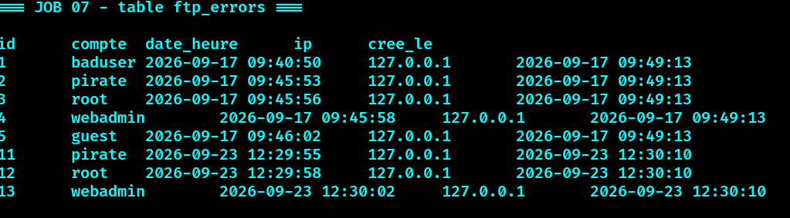

### Job 08 — `ssh_web_error.py` (collecte Web)
Logs Apache (`error.log`) → `psmm.web_errors`.

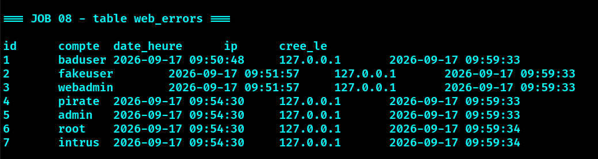

### Job 09 — `ssh_serveur_mail.py`
Rapport mail des tentatives d'accès de la veille à l'administrateur.

### Job 10 — `ssh_cron_backup.py`
Sauvegarde horodatée de la base (rétention 7), planifiée toutes les 3h.

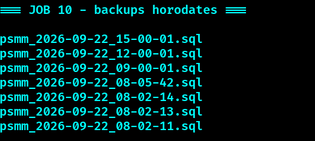

### Job 11 — `ssh_system_status.py`
Relevé CPU/RAM/DISK des 3 serveurs → base (purge > 72h).

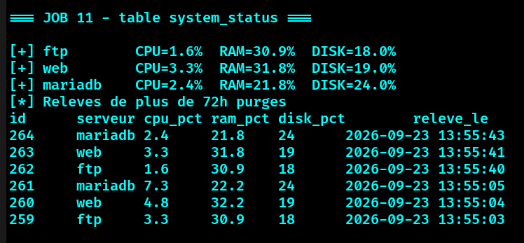

### Job 12 — `ssh_system_mail.py`
Alerte mail si un seuil est dépassé (CPU 70 % · Disque 90 % · RAM 80 %).

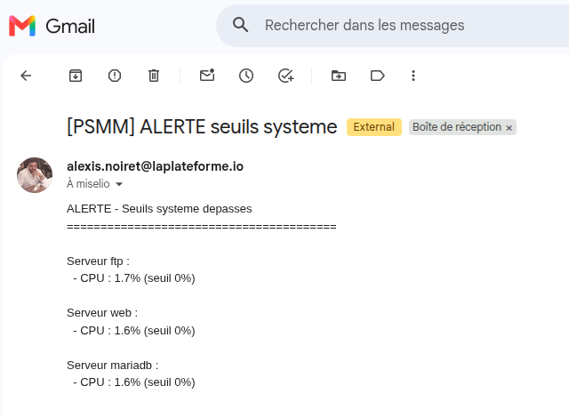

### Job 13 — Anti-spam mail (1/heure)
Au plus un mail par heure à l'administrateur, même en surcharge prolongée.

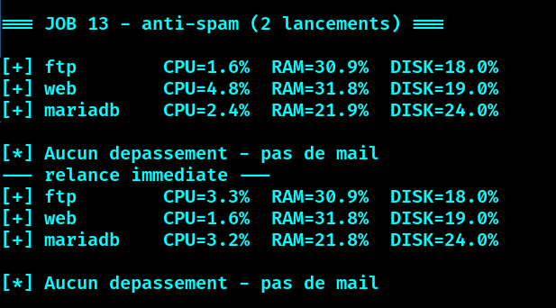

### Job 14 — `ssh_update.py` (mise à jour via Alcasar)
Authentification Alcasar → `apt update/upgrade` → vérification reboot → logout, serveur par serveur.

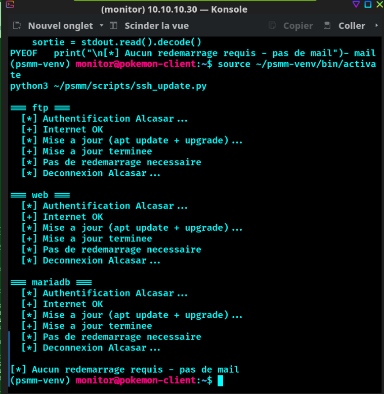

### Job 15 — `ssh_chat.py` (Google Chat)
Rapport quotidien + alerte temps réel des tentatives dans un Space Google Chat.

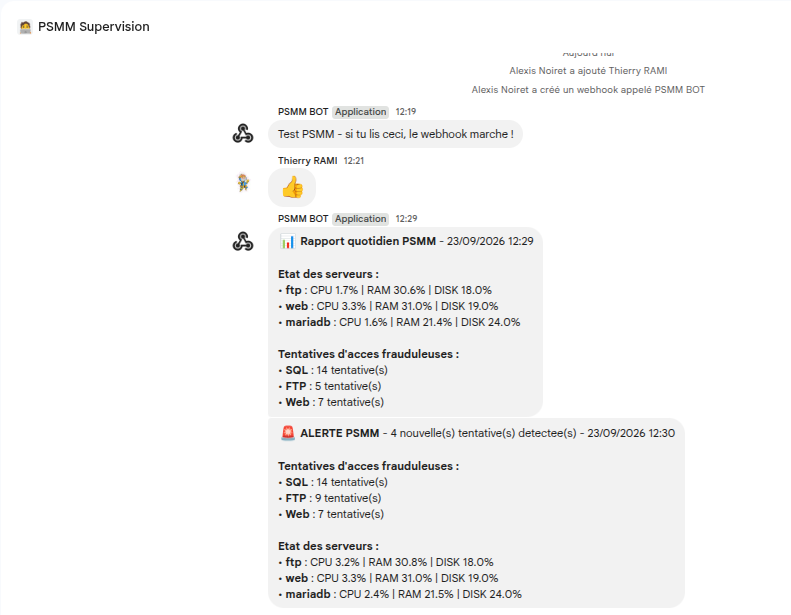

---

## 🚧 Défis techniques surmontés

### Réseau plateforme
En bridge **Wi-Fi**, les VM recevaient une IP mais ne pouvaient pas sortir (ARP `FAILED`).
**Diagnostic :** filtrage MAC du point d'accès. **Solution :** bridge **Ethernet** (pas de filtrage MAC par association).

### Authentification Alcasar
Le portail captif renvoyait une **erreur 411** sur les serveurs.
**Diagnostic :** Alcasar n'autorise qu'**un seul appareil à la fois par compte**.
**Solution :** authentification **séquentielle** (login → update → logout, un serveur après l'autre).

---

## ⏱️ Automatisation (cron)

| Tâche | Fréquence |
|-------|-----------|
| Sauvegarde de la base | toutes les 3h |
| Monitoring + alertes seuils | toutes les 5 min |
| Rapport Google Chat | chaque jour à 8h |
| Surveillance temps réel | toutes les 5 min |

---

## 📊 Support de soutenance

📎 [Diaporama de présentation (PDF)](docs/PSMM_soutenance.pdf)

---

*Alexis Noiret — Groupe pokemon — La Plateforme*
